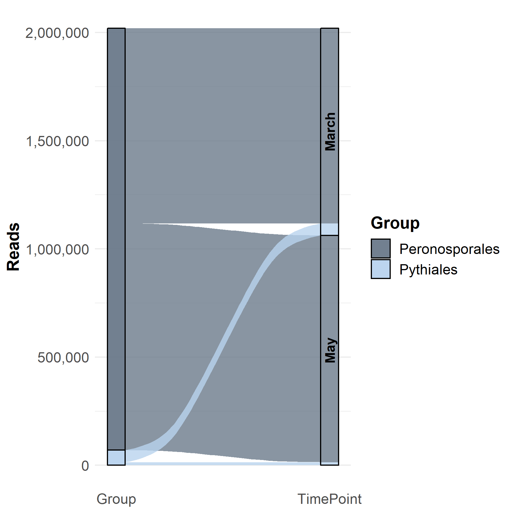
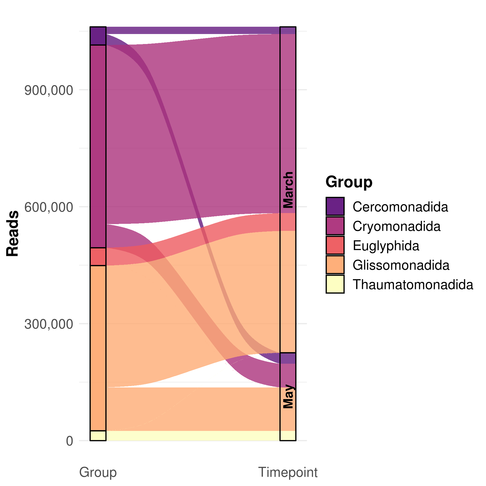
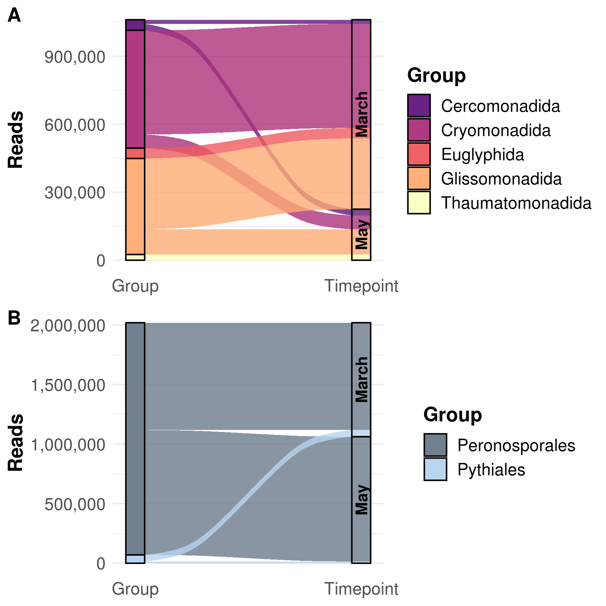

AirSampler\_Sankey
================

## Load Data

``` r
rm(list = ls())

library(ggplot2)
library(ggpubr)
```

    ## Loading required package: magrittr

``` r
library(ggalluvial)

OTU_Table = as.data.frame(read.csv("../00_Data/Oomycota/05_Oomycota_OTU_Table_new_min-freq-20617_min-feat-5_transposed_withMetadata.tsv", 
                     header = T, 
                     sep = "\t", 
                     stringsAsFactors = T))
SampleMetadata = OTU_Table[,1:5]
Stratum = SampleMetadata$Stratum
Timepoint = SampleMetadata$Timepoint
OTU_Table = OTU_Table[,6:ncol(OTU_Table)]
species = as.matrix(OTU_Table)

TAX = as.data.frame(read.csv("../00_Data/Oomycota/04_Oomycota_filtered_NCBI-nt_blasted_sorted_BestHit_TaxonomyTable_Oomycetes_sequences_vsearch-ITS1-BestHit_AnnotationRefined_NoPipe.tsv", 
                    header = F, 
                    sep = "\t", 
                    stringsAsFactors = T))

Abundances = colSums(OTU_Table)
TAX = cbind(TAX, Abundances)

colnames(TAX) = c("OTU_Number", "Order", "Family", "Genus", "Species", "Reference", "PercentID", "Abundance")
TAX$OTU_ID = paste0("OTU", TAX$OTU_Number, "_", TAX$Species)
TAX$Class = "Oomycota"

AlluvialData = data.frame("Group" = rep(unique(TAX$Order), 2))
AlluvialData$Timepoint = rep(c("March", "May"), each = 4)

## Remove Albuginales and Order_NoHit because of very low abundance

AlluvialData = AlluvialData[AlluvialData$Group != "Albuginales",]
AlluvialData = AlluvialData[AlluvialData$Group != "Order_NoHit",]

summer = function(a, b){
  sum(species[SampleMetadata$Timepoint == a, TAX$Order == b])
}

AlluvialData$Reads = mapply(summer, AlluvialData$Timepoint, AlluvialData$Group)

g = ggplot(AlluvialData, aes(y = Reads, axis1 = Group, axis2 = Timepoint)) +
  geom_alluvium(aes(fill = Group), width = 1/12, alpha = 0.8) + 
  geom_stratum(aes(fill = Group), alpha = 0.8, 
               width = 1/12, color = "black") +
  #geom_text(stat = "stratum", aes(label = after_stat(stratum)), 
  #           size = 3) +
  geom_text(stat = "stratum", aes(label = Timepoint), angle = 90, fontface = "bold", size = 4) +
  scale_x_discrete(limits = c("Group", "Timepoint"), expand = c(.05, .05)) +
  scale_fill_manual(values = colorRampPalette(c("slategray4", "slategray3", "slategray2"))(length(unique(AlluvialData$Group)))) +
  theme_minimal() + 
  scale_y_continuous(label = scales::comma) +
  theme(axis.text=element_text(size=12), 
        axis.title=element_text(size=14, face = "bold"), 
        legend.text = element_text(size = 12), 
        legend.title = element_text(size = 14, face = "bold"), 
        plot.title = element_text(size = 20, face = "bold", hjust = 0.5), 
        panel.grid.major.x = element_blank())

g
```

<!-- -->

## Cerco

``` r
TAX_cerco = read.csv("../00_Data/Cercozoa/04_Cercozoa_OTU_ContingencyTable_filtered_sequences_NCBI-nt_blasted_sorted_BestHit_TaxonomyTable_Cercozoa_sequences_vsearch-V4-BestHit_AnnotationRefined_noPipe.tsv", 
                    header = F, 
                    sep = "\t", 
                    stringsAsFactors = T)
OTU_Table_cerco = as.data.frame(read.csv("../00_Data/Cercozoa/05_Cercozoa_OTU_Table_min-freq-16922_min-feat-5_transposed_withMetadata.tsv",  
                     header = T, 
                     sep = "\t", 
                     stringsAsFactors = T))

SampleMetadata_Cerco = OTU_Table_cerco[,1:5]
OTU_Table_cerco = OTU_Table_cerco[,6:ncol(OTU_Table_cerco)]
species_cerco = as.matrix(OTU_Table_cerco)

Abundances = colSums(OTU_Table_cerco)
TAX_cerco = cbind(TAX_cerco, Abundances)

colnames(TAX_cerco) = c("OTU_Number", "Order", "Family", "Genus", "Species", "PercentID", "Abundance")
TAX_cerco$OTU_ID = paste0("OTU", TAX_cerco$OTU_Number, "_", TAX_cerco$Species)
TAX_cerco$Class = "Cercozoa"


AlluvialData_cerco = data.frame("Group" = rep(unique(TAX_cerco$Order), 2))
AlluvialData_cerco$Timepoint = rep(c("March", "May"), 
                          each = length(unique(TAX_cerco$Order)))

## Remove Cercozoa_XX and Marimonadida because of low abundance
AlluvialData_cerco = AlluvialData_cerco[AlluvialData_cerco$Group != "Marimonadida",]
AlluvialData_cerco = AlluvialData_cerco[AlluvialData_cerco$Group != "Order_NoHit",]

summer_cerco = function(a, b){
  sum(species_cerco[SampleMetadata_Cerco$Timepoint == a, TAX_cerco$Order == b])
}

AlluvialData_cerco$Reads = mapply(summer_cerco, AlluvialData_cerco$Timepoint, AlluvialData_cerco$Group)

g_cerco = ggplot(AlluvialData_cerco, 
                 aes(y = Reads, axis1 = Group, axis2 = Timepoint)) +
  geom_alluvium(aes(fill = Group), width = 1/12, alpha = 0.8) + 
  geom_stratum(aes(fill = Group), width = 1/12, alpha = 0.8, color = "black") +
  #geom_text(stat = "stratum", aes(label = after_stat(stratum)), 
  #           size = 3) +
  geom_text(stat = "stratum", aes(label = Timepoint), angle = 90, fontface = "bold", size = 4, color = "black") +
  scale_x_discrete(limits = c("Group", "Timepoint"), expand = c(.05, .05)) +
  #scale_fill_manual(values = colorRampPalette(c("indianred4", "#fb6a4a", "#fcae91", "#fee5d9"))(length(unique(AlluvialData_cerco$Group)))) +
  scale_fill_viridis_d(option = "magma", begin = 0.3) +
  theme_minimal() + 
  scale_y_continuous(label = scales::comma) +
  theme(axis.text=element_text(size=12), 
        axis.title=element_text(size=14, face = "bold"), 
        legend.text = element_text(size = 12), 
        legend.title = element_text(size = 14, face = "bold"), 
        plot.title = element_text(size = 20, face = "bold", hjust = 0.5), 
        panel.grid.major.x = element_blank())

g_cerco
```

<!-- -->

## Combine

``` r
combi = ggarrange(g_cerco, g, 
                  labels = c("A", "B"), 
                  ncol = 1, nrow = 2, 
                  common.legend = F, legend = "right", 
                  align = "v", vjust = 1.5) #%>%
  #annotate_figure(fig.lab = "Figure X", fig.lab.face = "bold", 
  #                fig.lab.size = 18, 
  #                top = text_grob("Non-metric multidimensional scaling", 
  #                                face = "bold", size = 20))

#ggsave("NMDSCombined.tif", plot = combi, 
#       device = "tiff", dpi = 600, width = 28, height = 11, 
#       units = "cm")
ggsave("SankeyCombined.png", plot = combi, 
       device = "png", dpi = 300, width = 17.7, height = 15, 
       units = "cm")
ggsave("SankeyCombined.jpeg", plot = combi, 
       device = "jpeg", dpi = 300, width = 17.7, height = 15, 
       units = "cm")
ggsave("SankeyCombined.pdf", plot = combi, 
       device = "pdf", dpi = 300, width = 17.7, height = 15, 
       units = "cm")
ggsave("SankeyCombined.tiff", plot = combi, 
       device = "tiff", dpi = 300, width = 17.7, height = 15, 
       units = "cm", compression = "lzw")

combi
```

<!-- -->
