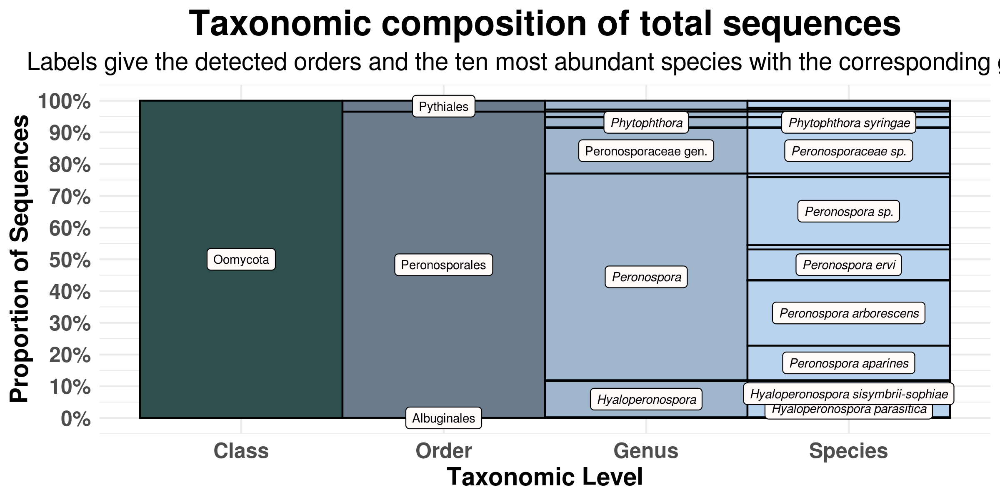
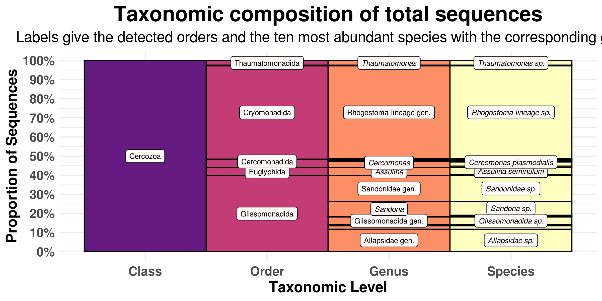
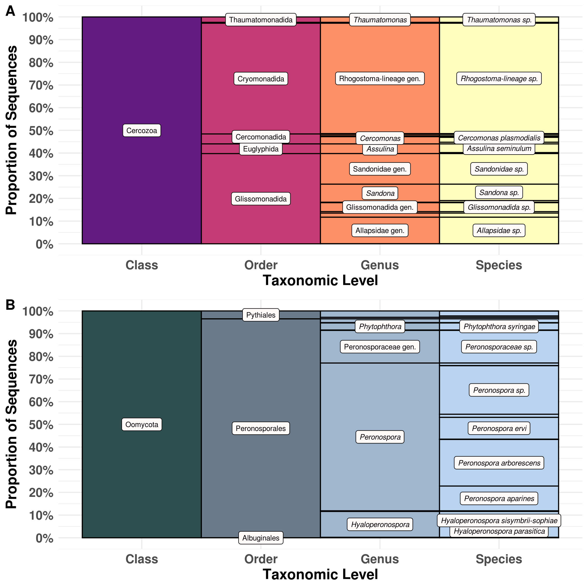

AirSampler TaxonomyOverview
================

## Load Data

``` r
rm(list = ls())

library(magrittr)
library(ggplot2)
library(igraph)
library(ggraph)
library(plyr)
library(ggpubr)


TAX = as.data.frame(read.csv("../00_Data/Oomycota/04_Oomycota_filtered_NCBI-nt_blasted_sorted_BestHit_TaxonomyTable_Oomycetes_sequences_vsearch-ITS1-BestHit_AnnotationRefined_NoPipe.tsv", 
                    header = F, 
                    sep = "\t", 
                    stringsAsFactors = T))
OTU_Table = as.data.frame(read.csv("../00_Data/Oomycota/05_Oomycota_OTU_Table_new_min-freq-20617_min-feat-5_transposed_withMetadata.tsv", 
                     header = T, 
                     sep = "\t", 
                     stringsAsFactors = T))

SampleMetadata = OTU_Table[,1:5]
OTU_Table = OTU_Table[,6:ncol(OTU_Table)]

Abundances = colSums(OTU_Table)
TAX = cbind(TAX, Abundances)

colnames(TAX) = c("OTU_Number", "Order", "Family", "Genus", "Species", "Reference", "PercentID", "Abundance")
TAX$OTU_ID = paste0("OTU", TAX$OTU_Number, "_", TAX$Species)
TAX$Class = "Oomycota"


# aggregate same species and sum their abundance
TAX_aggregated = ddply(TAX, "Species", numcolwise(sum))
# skip the family because it's quite redundant with the order
TAX = subset(TAX, select = c("Class", "Order", "Genus", "Species"))
TAX = TAX[order(TAX[,"Species"]),]
TAX_tmp0 = cbind.data.frame(Node1 = TAX$Class, Node.2 = TAX$Order)
TAX_tmp1 = cbind.data.frame(Node1 = TAX$Order, Node.2 = TAX$Genus)
#TAX_tmp2 = cbind.data.frame(Node1 = TAX$Family, Node.2 = TAX$Genus)
TAX_tmp3 = cbind.data.frame(Node1 = TAX$Genus, Node.2 = TAX$Species)
TAX_nodes = cbind.data.frame(Node1 = TAX_aggregated$Species, size = TAX_aggregated$Abundance)
# Here we extract the "non-leaf" levels, like Order and Genus
# then we set their abundance to 0
Others = cbind.data.frame(Node1 = c(as.character(TAX$Class), 
                                    as.character(TAX$Order), 
                                    #as.character(TAX$Family), 
                                    as.character(TAX$Genus)), 
                          size = 0) %>% unique()
Others$size = as.numeric(Others$size)
TAX_nodes = rbind(Others, TAX_nodes)
TAX_tree = rbind(TAX_tmp0, 
                 TAX_tmp1, 
                 #TAX_tmp2, 
                 TAX_tmp3)
TAX_nodes$size = as.numeric(TAX_nodes$size)
```

## Prepare Graph

``` r
edges = as.data.frame(TAX_tree)
vertices = as.data.frame(TAX_nodes)
vertices$size = as.numeric(vertices$size)
# mask species labels to plot only higher taxonomic labels
# like Order, Family and Genus
vertices$BaseHits = ifelse(vertices$size != 0, 
                           NA, 
                           as.character(vertices$Node1))
vertices$BaseHitsMasked = ifelse(grepl("NoHit", vertices$BaseHits), 
                                 "NoHit", 
                                 vertices$BaseHits)
# Here we look for the ten most abundant species
vertices$TopHits = ifelse(vertices$size %in% seq(from = 0, to = 46000, by = 1), 
                          NA, 
                          as.character(vertices$Node1))
vertices$TopHitsMasked = 
  ifelse(grepl("NoHit", vertices$TopHits), 
         paste0(lapply(strsplit(as.character(vertices$TopHits), "_"), `[[`, 1), "_sp."), 
         vertices$TopHits)
vertices$TopHitsMasked = 
  ifelse(grepl("_cf", vertices$TopHits), 
         paste0(lapply(strsplit(as.character(vertices$TopHits), "_"), `[[`, 1), "_sp."), 
         vertices$TopHitsMasked)
# get the genera from the top hits
vertices$TopHitsGenera = ifelse(vertices$Node1 %in% (edges$Node1[edges$Node.2 %in% vertices$TopHits] %>% unique()), 
                                as.character(vertices$Node1), 
                                NA)
vertices$TopHitsGeneraMasked = ifelse(grepl("NoHit", vertices$TopHitsGenera), 
                                      paste0(lapply(strsplit(as.character(vertices$TopHitsGenera), 
                                                       "_Genus_NoHit"), `[[`, 1), "_gen."), 
                                vertices$TopHitsGenera)
# get the order
vertices$Order = c("Oomycota", ifelse(vertices$Node1 %in% TAX$Order, 
                        as.character(vertices$Node1), 
                        NA)[2:length(vertices$Node1)])
vertices$size = as.numeric(vertices$size)
graph = graph_from_data_frame(edges, vertices = vertices, directed = T)
set.seed(1)

vertices$TopHitsMasked = gsub("_", " ", vertices$TopHitsMasked)
vertices$TopHitsGeneraMasked = gsub("_", " ", vertices$TopHitsGeneraMasked)
vertices$Order = gsub("Order_NoHit", NA_character_, vertices$Order)
```

## Plot

``` r
g = ggraph(graph, 'partition', circular = F, weight = size) + 
  geom_node_tile(aes(fill = as.factor(depth)), show.legend = F) +
  theme_minimal() +
  scale_fill_manual(values = c("darkslategray", "slategray4", 
                               "slategray3", "slategray2")) +
  # order labels
  geom_node_label(aes(x = x, y = y, label = vertices$Order), 
                 #angle = node_angle(x, y) + ifelse(x > 0, 90, -90)), 
            hjust = 0.5, vjust = 0.5, repel = F, 
            fill = "snow1", size = 2.5) + 
  # Top 10 abundant taxa
  geom_node_label(aes(x = x, y = y, label = vertices$TopHitsMasked), 
                 #angle = node_angle(x, y) + ifelse(x > 0, 90, -90)), 
            hjust = 0.5, vjust = 0.5, repel = F, 
            fill = "snow1", size = 2.5, fontface = "italic") +
  # Corresponding Genus
  geom_node_label(aes(x = x, y = y, label = vertices$TopHitsGeneraMasked), 
                 #angle = node_angle(x, y) + ifelse(x > 0, 90, -90)), 
            hjust = 0.5, vjust = 0.5, repel = F, 
            fill = "snow1", size = 2.5)
# Get the maximum x value, this will be used to convert the axis to percent
Maxlabel = max(g$data$width)
g = g +
  scale_x_continuous(labels = function(x) paste0(round(x/Maxlabel*100,1), "%"), 
                     breaks = seq(from = 0, to = Maxlabel, length.out = 11)) +
  scale_y_continuous(breaks = c(1.5, 2.5, 3.5, 4.5),
                     minor_breaks = NULL, 
                     labels = c("Class", "Order", "Genus", "Species")) +
  labs(x = "Proportion of Sequences", 
       y = "Taxonomic Level", 
       title = "Taxonomic composition of total sequences", 
       subtitle = "Labels give the detected orders and the ten most abundant species with the corresponding genus") + 
  coord_flip() + 
  theme(axis.text=element_text(size=12, face = "bold"), 
        axis.title=element_text(size=14, face = "bold"), 
        plot.title = element_text(size = 20, face = "bold", hjust = 0.5), 
        plot.subtitle = element_text(size = 14, hjust = 0.5))

g
```

<!-- -->

## Cercozoa

``` r
TAX_cerco = read.csv("../00_Data/Cercozoa/04_Cercozoa_OTU_ContingencyTable_filtered_sequences_NCBI-nt_blasted_sorted_BestHit_TaxonomyTable_Cercozoa_sequences_vsearch-V4-BestHit_AnnotationRefined_noPipe.tsv", 
                    header = F, 
                    sep = "\t", 
                    stringsAsFactors = T)
OTU_Table_cerco = as.data.frame(read.csv("../00_Data/Cercozoa/05_Cercozoa_OTU_Table_min-freq-16922_min-feat-5_transposed_withMetadata.tsv", 
                     header = T, 
                     sep = "\t", 
                     stringsAsFactors = T))

SampleMetadata_Cerco = OTU_Table_cerco[,1:5]
OTU_Table_cerco = OTU_Table_cerco[,6:ncol(OTU_Table_cerco)]

Abundances = colSums(OTU_Table_cerco)
TAX_cerco = cbind(TAX_cerco, Abundances)

colnames(TAX_cerco) = c("OTU_Number", "Order", "Family", "Genus", "Species", "Reference", "PercentID", "Abundance")
TAX_cerco$OTU_ID = paste0("OTU", TAX_cerco$OTU_Number, "_", TAX_cerco$Species)
TAX_cerco$Class = "Cercozoa"
Species_cerco = TAX_cerco$Species

# aggregate same species and sum their abundance
TAX_cerco_aggregated = ddply(TAX_cerco, "Species_cerco", numcolwise(sum))
colnames(TAX_cerco_aggregated) = c("Species", "OTU_Number", "PercentID", "Abundance")
# skip the family because it's quite redundant with the order
TAX_cerco = subset(TAX_cerco, select = c("Class", "Order", "Genus", "Species"))
TAX_cerco = TAX_cerco[order(TAX_cerco[,"Species"]),]

TAX_cerco_tmp0 = cbind.data.frame(Node1 = TAX_cerco$Class, Node.2 = TAX_cerco$Order)
TAX_cerco_tmp1 = cbind.data.frame(Node1 = TAX_cerco$Order, Node.2 = TAX_cerco$Genus)
#TAX_cerco_tmp2 = cbind.data.frame(Node1 = TAX_cerco$Family, Node.2 = TAX_cerco$Genus)
TAX_cerco_tmp3 = cbind.data.frame(Node1 = TAX_cerco$Genus, Node.2 = TAX_cerco$Species)
TAX_cerco_nodes = cbind.data.frame(Node1 = TAX_cerco_aggregated$Species, size = TAX_cerco_aggregated$Abundance)
Others_cerco = cbind.data.frame(Node1 = c(as.character(TAX_cerco$Class), 
                                    as.character(TAX_cerco$Order), 
                                    #as.character(TAX_cerco$Family), 
                                    as.character(TAX_cerco$Genus)), 
                          size = 0) %>% unique()

Others_cerco$size = as.numeric(Others_cerco$size)
TAX_cerco_nodes = rbind(Others_cerco, TAX_cerco_nodes)
TAX_cerco_tree = rbind(TAX_cerco_tmp0, 
                 TAX_cerco_tmp1, 
                 #TAX_cerco_tmp2, 
                 TAX_cerco_tmp3)
TAX_cerco_nodes$size = as.numeric(TAX_cerco_nodes$size)

edges_cerco = as.data.frame(TAX_cerco_tree)
vertices_cerco = as.data.frame(TAX_cerco_nodes)
vertices_cerco$size = as.numeric(vertices_cerco$size)

# mask species labels to plot only higher TAX_cercoonomic labels
vertices_cerco$BaseHits = ifelse(vertices_cerco$size != 0, 
                           NA, 
                           as.character(vertices_cerco$Node1))
vertices_cerco$BaseHitsMasked = ifelse(grepl("NoHit", vertices_cerco$BaseHits), 
                                 "NoHit", 
                                 vertices_cerco$BaseHits)
vertices_cerco$TopHits = ifelse(vertices_cerco$size %in% seq(from = 0, to = 20000, by = 1), 
                          NA, 
                          as.character(vertices_cerco$Node1))
vertices_cerco$TopHitsMasked = ifelse(grepl("NoHit", vertices_cerco$TopHits), 
                                paste0(lapply(strsplit(as.character(vertices_cerco$TopHits), 
                                                       "_"), `[[`, 1), "_sp."), 
                                vertices_cerco$TopHits)

# get the genera from the top hits
vertices_cerco$TopHitsGenera = ifelse(vertices_cerco$Node1 %in% (edges_cerco$Node1[edges_cerco$Node.2 %in% vertices_cerco$TopHits] %>% unique()), 
                                as.character(vertices_cerco$Node1), 
                                NA)
vertices_cerco$TopHitsGeneraMasked = ifelse(grepl("NoHit", vertices_cerco$TopHitsGenera), 
                                      paste0(lapply(strsplit(as.character(vertices_cerco$TopHitsGenera), 
                                                       "_Genus_NoHit"), `[[`, 1), "_gen."), 
                                vertices_cerco$TopHitsGenera)

# get the order
vertices_cerco$Order = c("Cercozoa", ifelse(vertices_cerco$Node1 %in% TAX_cerco$Order, 
                        as.character(vertices_cerco$Node1), 
                        NA)[2:length(vertices_cerco$Node1)])

graph_cerco = graph_from_data_frame(edges_cerco, vertices = vertices_cerco, directed = T)
set.seed(1)

vertices_cerco$TopHitsMasked = gsub("_", " ", vertices_cerco$TopHitsMasked)
vertices_cerco$TopHitsGeneraMasked = gsub("_", " ", vertices_cerco$TopHitsGeneraMasked)
vertices_cerco$Order = gsub("Order_NoHit", 
                            NA_character_, vertices_cerco$Order)
vertices_cerco$Order = gsub("Marimonadida", 
                            NA_character_, vertices_cerco$Order)

g_cerco = ggraph(graph_cerco, 'partition', circular = F, weight = size) + 
  geom_node_tile(aes(fill = as.factor(depth)), show.legend = F) +
  theme_minimal() +
  scale_fill_viridis_d(option = "magma", begin = 0.3) +
                     #values = c("indianred4", "#fb6a4a", 
                      #         "#fcae91", "#fee5d9")) +
  # order labels
  geom_node_label(aes(x = x, y = y, label = vertices_cerco$Order), 
                 #angle = node_angle(x, y) + ifelse(x > 0, 90, -90)), 
            hjust = 0.5, vjust = 0.5, repel = F, 
            fill = "snow1", size = 2.5, 
            nudge_x = ifelse(vertices_cerco$Order == "Cercomonadida", 
                             10000, 0)) + 
  # Top 10 abundant TAX_cercoa
  geom_node_label(aes(x = x, y = y, label = vertices_cerco$TopHitsMasked), 
                 #angle = node_angle(x, y) + ifelse(x > 0, 90, -90)), 
            hjust = 0.5, vjust = 0.5, repel = F, 
            fill = "snow1", size = 2.5, fontface = "italic", 
            nudge_x = ifelse(vertices_cerco$TopHitsMasked == "Cercomonas plasmodialis", 10000, 0)) +
  # Corresponding Genus
  geom_node_label(aes(x = x, y = y, label = vertices_cerco$TopHitsGeneraMasked), 
                 #angle = node_angle(x, y) + ifelse(x > 0, 90, -90)), 
            hjust = 0.5, vjust = 0.5, repel = F, 
            fill = "snow1", size = 2.5, 
            nudge_x = ifelse(vertices_cerco$TopHitsGeneraMasked == "Cercomonas", 
                             10000, 0))

# Get the maximum x value, this will be used to convert the axis to percent
Maxlabel_cerco = max(g_cerco$data$width)

g_cerco = g_cerco +
  scale_x_continuous(labels = function(x) paste0(round(x/Maxlabel_cerco*100,1), "%"), 
                     breaks = seq(from = 0, to = Maxlabel_cerco, length.out = 11)) +
  scale_y_continuous(breaks = c(1.5, 2.5, 3.5, 4.5),
                     minor_breaks = NULL, 
                     labels = c("Class", "Order", "Genus", "Species")) +
  labs(x = "Proportion of Sequences", 
       y = "Taxonomic Level", 
       title = "Taxonomic composition of total sequences", 
       subtitle = "Labels give the detected orders and the ten most abundant species with the corresponding genus") + 
  coord_flip() + 
  theme(axis.text=element_text(size=12, face = "bold"), 
        axis.title=element_text(size=14, face = "bold"), 
        plot.title = element_text(size = 20, face = "bold", hjust = 0.5), 
        plot.subtitle = element_text(size = 14, hjust = 0.5))

g_cerco
```

<!-- -->

## Combine

``` r
g$labels$title = NULL
g_cerco$labels$title = NULL
g$labels$subtitle = NULL
g_cerco$labels$subtitle = NULL

combi = ggarrange(g_cerco, g, 
                  labels = c("A", "B"), 
                  ncol = 1, nrow = 2) #%>%
  #annotate_figure(fig.lab = "Figure X", fig.lab.face = "bold", 
  #                fig.lab.size = 18, 
  #                top = text_grob("Non-metric multidimensional scaling", 
  #                                face = "bold", size = 20))
#ggsave("NMDSCombined.tif", plot = combi, 
#       device = "tiff", dpi = 600, width = 28, height = 11, 
#       units = "cm")
ggsave("AirSampler_TaxonomicCompositionCombined.png", plot = combi, 
       device = "png", dpi = 300, width = 17.7, height = 17.7, 
       units = "cm")
ggsave("AirSampler_TaxonomicCompositionCombined.jpeg", plot = combi, 
       device = "jpeg", dpi = 300, width = 17.7, height = 17.7, 
       units = "cm")
ggsave("AirSampler_TaxonomicCompositionCombined.pdf", plot = combi, 
       device = "pdf", dpi = 300, width = 17.7, height = 17.7, 
       units = "cm")
ggsave("AirSampler_TaxonomicCompositionCombined.tiff", plot = combi, 
       device = "tiff", dpi = 300, width = 17.7, height = 17.7, 
       units = "cm", compression = "lzw")

combi
```

<!-- -->
