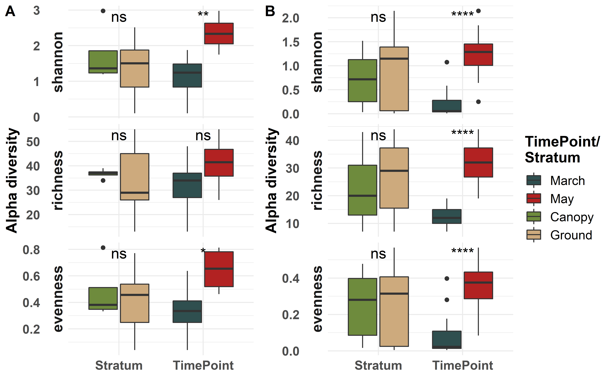

AirSampler AlphaBoxplot
================

## Load Data

``` r
rm(list = ls())

library(ggplot2)
library(viridis)
library(vegan)
library(ggpubr)
library(ggsignif)

#setwd("04_Alpha_Diversity/")
OTU_Table = as.data.frame(read.csv("../00_Data/Oomycota/05_Oomycota_OTU_Table_new_min-freq-20617_min-feat-5_transposed_withMetadata.tsv", 
                     header = T, 
                     sep = "\t", 
                     stringsAsFactors = T))
SampleMetadata = OTU_Table[,1:5]
Stratum = SampleMetadata$Stratum
Timepoint = SampleMetadata$Timepoint
OTU_Table = OTU_Table[,6:ncol(OTU_Table)]
```

## Calculate Alpha Diversity

To run the diversity analyses, simply load the table and specify the
`index` - in this case: The Simpson index. Then convert it into a
dataframe and add the metadata and group.

``` r
shannon = diversity(OTU_Table, index = "shannon")
shannon = as.data.frame(shannon)
shannon$Comparison = Timepoint
rownames(shannon) = SampleMetadata$SampleID
shannon$Group = "Oomycota"
df = shannon
df$richness = specnumber(OTU_Table)
df$evenness = df$shannon/log(df$richness)
df$Type = "Timepoint"
df2 = df
df2$Comparison = Stratum
df2$Type = "Stratum"
df3 = rbind(df, df2)
df_melted = reshape2::melt(df3)
```

    ## Using Comparison, Group, Type as id variables

## Plot the Figure

Now we put the diverity measurements into a habitat specific context. It
can be easiest visualised in a boxplot:

``` r
g = ggplot(df_melted, aes(x = Type, y = value, fill = Comparison)) + 
  #stat_boxplot(geom = "errorbar", width = 0.2, show.legend = F) +
  geom_boxplot(show.legend = T) + 
  theme_minimal() + 
  labs(y = "Alpha diversity", 
       x = NULL) +
  theme(axis.text=element_text(size=12, face = "bold"), 
        axis.title=element_text(size=14, face = "bold"), 
        plot.title = element_text(size = 20, face = "bold", hjust = 0.5), 
        plot.subtitle = element_text(size = 14, hjust = 0.5), 
        legend.text = element_text(size = 12), 
        legend.title = element_text(size = 14, face = "bold"), 
        strip.text = element_text(size=14, face = "bold")) +
  #geom_signif(comparisons = list(c("March", "May")), 
  #            map_signif_level=TRUE) + 
  #geom_signif(comparisons = list(c("Canopy", "Ground")), 
  #            map_signif_level=TRUE) +
  stat_compare_means(aes(group = Comparison), label = "p.signif", 
                     size = 5, method = "wilcox.test", 
                     vjust = 1) +
  scale_fill_manual(values = c("darkslategrey", "firebrick", 
                               "darkolivegreen4", "burlywood3"), 
                    limits = c("March", "May", "Canopy", "Ground"), 
                    name = "Timepoint/\nStratum") +
  facet_grid(rows = vars(variable), scales = "free", switch = "y")
```

## Cercozoa

Let’s check if the Cercozoa show a similar pattern:

``` r
Cerco_OTU_Table = as.data.frame(read.csv("../00_Data/Cercozoa/05_Cercozoa_OTU_Table_min-freq-16922_min-feat-5_transposed_withMetadata.tsv", 
                     header = T, 
                     sep = "\t", 
                     stringsAsFactors = T))
Cerco_SampleMetadata = Cerco_OTU_Table[,1:5]
Cerco_Timepoint = Cerco_SampleMetadata$Timepoint
Cerco_Stratum = Cerco_SampleMetadata$Stratum
Cerco_OTU_Table = Cerco_OTU_Table[,6:ncol(Cerco_OTU_Table)]

Cerco_shannon = diversity(Cerco_OTU_Table, index = "shannon")
Cerco_shannon = as.data.frame(Cerco_shannon)
rownames(Cerco_shannon) = Cerco_SampleMetadata$SampleID
colnames(Cerco_shannon) = "shannon"
Cerco_shannon$Comparison = Cerco_Timepoint
Cerco_shannon$Group = "Cercozoa"
df_cerco = Cerco_shannon
df_cerco$richness = specnumber(Cerco_OTU_Table)
df_cerco$evenness = df_cerco$shannon/log(df_cerco$richness)
df_cerco$Type = "Timepoint"
df_cerco2 = df_cerco
df_cerco2$Comparison = Cerco_Stratum
df_cerco2$Type = "Stratum"
df_cerco_3 = rbind(df_cerco, df_cerco2)

df_cerco_melted = reshape2::melt(df_cerco_3)
```

## Plot Cercozoa Figure

``` r
g_cerco = ggplot(df_cerco_melted, aes(x = Type, y = value, fill = Comparison)) + 
  #stat_boxplot(geom = "errorbar", width = 0.2, show.legend = F) +
  geom_boxplot(show.legend = T) + 
  theme_minimal() + 
  labs(y = "Alpha diversity", 
       x = NULL) +
  theme(axis.text=element_text(size=12, face = "bold"), 
        axis.title=element_text(size=14, face = "bold"), 
        plot.title = element_text(size = 20, face = "bold", hjust = 0.5), 
        plot.subtitle = element_text(size = 14, hjust = 0.5), 
        legend.text = element_text(size = 12), 
        legend.title = element_text(size = 14, face = "bold"), 
        strip.text = element_text(size=14, face = "bold")) +
  #geom_signif(comparisons = list(c("March", "May")), 
  #            map_signif_level=TRUE) + 
  #geom_signif(comparisons = list(c("Canopy", "Ground")), 
  #            map_signif_level=TRUE) + 
  stat_compare_means(aes(group = Comparison), label = "p.signif", 
                     size = 5, method = "wilcox.test", 
                     vjust = 1) +
  scale_fill_manual(values = c("darkslategrey", "firebrick", 
                               "darkolivegreen4", "burlywood3"), 
                    limits = c("March", "May", "Canopy", "Ground"), 
                    name = "Timepoint/\nStratum") +
  facet_grid(rows = vars(variable), scales = "free", switch = "y")
```

## Combine Plots

``` r
combi = ggarrange(g_cerco, g, 
                  labels = c("A", "B"), 
                  ncol = 2, nrow = 1, 
                  align = "v", common.legend = T, 
                  legend = "right")

combi = combi + theme(rect = element_rect(fill = "transparent"))#%>%
  #annotate_figure(top = text_grob("Alpha diversity of samples", 
  #                                face = "bold", size = 20), 
  #                fig.lab = "Figure X", fig.lab.face = "bold", 
  #                fig.lab.size = 18)
ggsave("AlphaBoxplotCombined.jpeg", plot = combi, 
       device = "jpeg", dpi = 300, width = 17.7, height = 10, 
       units = "cm")
ggsave("AlphaBoxplotCombined.png", plot = combi, 
       device = "png", dpi = 300, width = 17.7, height = 10, 
       units = "cm")
ggsave("AlphaBoxplotCombined.pdf", plot = combi, 
       device = "pdf", dpi = 300, width = 17.7, height = 10, 
       units = "cm")
ggsave("AlphaBoxplotCombined.tiff", plot = combi, 
       device = "tiff", dpi = 300, width = 17.7, height = 10, 
       units = "cm", compression = "lzw")
combi
```

<!-- -->
