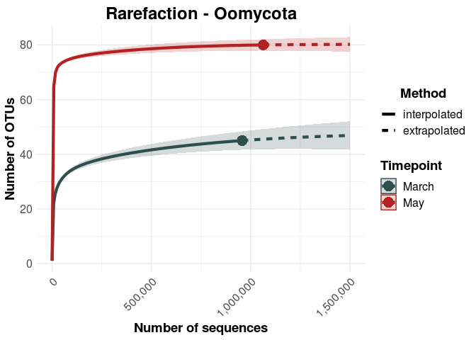

AirSampler\_Rarefaction
================

Testing the sampling depth is a crucial step for community ecologists.
We need to be sure that our sampling covers (nearly) the whole diversity
per sample, so unexplained variance is not due to low sequencing depth.
To do so, we use rarefaction curves.

Here, we use the [iNEXT
Package](http://chao.stat.nthu.edu.tw/wordpress/software_download/inext-online/)
by Anne Chao. It performs interpolation (rarefaction) as well as
extrapolation. First we load the packages and data:

``` r
rm(list = ls())
library(iNEXT)
library(ggplot2)
library(RColorBrewer)
library(ggpubr)
library(viridis)

OTU_Table = as.data.frame(read.csv("../00_Data/Oomycota/05_Oomycota_OTU_Table_new_min-freq-20617_min-feat-5_transposed_withMetadata.tsv", 
                     header = T, 
                     sep = "\t", 
                     stringsAsFactors = T))
SampleMetadata = OTU_Table[,1:5]
rownames(OTU_Table) = SampleMetadata$SampleID
rownames(SampleMetadata) = SampleMetadata$SampleID
species = OTU_Table[,6:ncol(OTU_Table)]
species_mat = as.matrix(species)
```

The OTU Table contains several replicates in terms of microhabitat and
tree species. We want to test the rarefaction for the microhabitats, so
now we aggregate the OTU table:

``` r
species_mat_aggregated = aggregate(species_mat, by = list(SampleMetadata$Timepoint), FUN = "sum")
rownames(species_mat_aggregated) = levels(list(SampleMetadata$Timepoint)[[1]])
species_mat_aggregated = species_mat_aggregated[,-1]
```

Now we perform the rarefaction with `iNEXT`. The function requires the
species in rows and the samples in the columns, so we need to transpose
the table. Then, we specify several parameters (more details in the
[manual](http://140.114.36.3/wordpress/wp-content/uploads/software/iNEXT_Introduction.pdf)):

  - `q` means the diversity measure. We set it to 0 because we want the
    species richness (i.e. the number of OTUs)
  - `nboot` is the number of bootstrap replicates for the extrapolation
  - `conf` is the confidence interval for the extrapolation
  - `knots` is the number of calculations for the rarefaction curve. The
    more knots the smoother the curve (but the more time it requires)
  - `endpoint` means in this case the final number of sequences for the
    extrapolation

The calculation might take a long time, so it makes sense to save the
result and load it afterwards for the plotting

``` r
# Uncomment the following lines when you run this script for the first time
# After that, just load the Output file
#Oomycota_out = iNEXT(t(species_mat_aggregated), q = 0, #q = 0 means species richness
#      datatype = "abundance", nboot = 99, conf = 0.97, knots = 250, endpoint = 1500000)
#save(Oomycota_out, file = "Oomycota_out.RData")
load("Oomycota_out.RData")
```

The resulting file can be directly loaded into `ggiNEXT`, which converts
it into a ggplot object. With `type` you can specify the type of plot.
In this case, it is the number of sequences plotted against the number
of OTUs (because we specified q = 0, the species richness). The default
x-axis label would be “Number of Individuals”, but as we are dealing
with Barcoding data we override the label with “Number of Sequences”.

``` r
g = ggiNEXT(Oomycota_out, type = 1, color.var = "site") +
  scale_fill_manual(name = "Timepoint", 
                    values = c("darkslategrey", "firebrick"), 
                    limits = c("March", "May")) +
  scale_color_manual(name = "Timepoint", 
                    values = c("darkslategrey", "firebrick"), 
                    limits = c("March", "May")) +
  scale_shape_manual(name = "Timepoint", 
                    values = c(16, 16), 
                    limits = c("March", "May")) + 
  theme_minimal() +
  labs(title = "Rarefaction - Oomycota", 
       x = "Number of sequences", y = "Number of OTUs") +
  scale_x_continuous(labels = scales::comma) +
  theme(legend.text = element_text(size = 12), 
        legend.title = element_text(size = 14, face = "bold"), 
        legend.position = "right",
        legend.direction = "vertical", 
        plot.title = element_text(size = 18, face = "bold", hjust = 0.5, vjust = 0.5), 
        legend.title.align = 0.5,
        axis.title = element_text(size = 14, face = "bold"), 
        axis.text = element_text(size = 12), 
        axis.text.x = element_text(angle = 45, hjust = 1)) +
  guides(fill = guide_legend(title="Timepoint"), 
         color = guide_legend(title="Timepoint"), 
         shape = guide_legend(title="Timepoint"))
# In the default plot, brighter colors are hard to see.
# So here we rearrange the layers to make them more visible
g$layers = c(g$layers[[3]], g$layers[[2]], g$layers[[1]])
g
```

<!-- -->

In all microhabitats, the rarefaction curves approach a plateau. This
means our sequencing effort was enough to uncover most of the diversity.
Increasing the sampling depth would only yield slightly more OTUs.
That’s great\!

``` r
OTU_Table_cerco = as.data.frame(read.csv("../00_Data/Cercozoa/05_Cercozoa_OTU_Table_min-freq-16922_min-feat-5_transposed_withMetadata.tsv", 
                     header = T, 
                     sep = "\t", 
                     stringsAsFactors = T))
SampleMetadata_cerco = OTU_Table_cerco[,1:5]
rownames(OTU_Table_cerco) = SampleMetadata_cerco$SampleID
rownames(SampleMetadata_cerco) = SampleMetadata_cerco$SampleID
species_cerco = OTU_Table_cerco[,6:ncol(OTU_Table_cerco)]
species_mat_cerco = as.matrix(species_cerco)
species_mat_aggregated_cerco = aggregate(species_mat_cerco, by = list(SampleMetadata_cerco$Timepoint), FUN = "sum")
rownames(species_mat_aggregated_cerco) = levels(list(SampleMetadata_cerco$Timepoint)[[1]])
species_mat_aggregated_cerco = species_mat_aggregated_cerco[,-1]

#Cercozoa_out = iNEXT(t(species_mat_aggregated_cerco), q = 0, #q = 0 means species richness
#      datatype = "abundance", nboot = 99, conf = 0.97, knots = 250, endpoint = 1500000)
#save(Cercozoa_out, file = "Cercozoa_out.RData")
load("Cercozoa_out.RData")

g_cerco = ggiNEXT(Cercozoa_out, type = 1, color.var = "site") +
  scale_fill_manual(name = "Timepoint", 
                    values = c("darkslategrey", "firebrick"), 
                    limits = c("March", "May")) +
  scale_color_manual(name = "Timepoint", 
                    values = c("darkslategrey", "firebrick"), 
                    limits = c("March", "May")) +
  scale_shape_manual(name = "Timepoint", 
                    values = c(16, 16), 
                    limits = c("March", "May")) + 
  theme_minimal() +
  labs(title = "Rarefaction - Cercozoa", 
       x = "Number of sequences", y = "Number of OTUs") +
  scale_x_continuous(labels = scales::comma) +
  theme(legend.text = element_text(size = 12), 
        legend.title = element_text(size = 14, face = "bold"), 
        legend.position = "right",
        legend.direction = "vertical", 
        plot.title = element_text(size = 18, face = "bold", hjust = 0.5, vjust = 0.5), 
        legend.title.align = 0.5,
        axis.title = element_text(size = 14, face = "bold"), 
        axis.text = element_text(size = 12), 
        axis.text.x = element_text(angle = 45, hjust = 1)) +
  guides(fill = guide_legend(title="Timepoint"), 
         color = guide_legend(title="Timepoint"), 
         shape = guide_legend(title="Timepoint"))
# In the default plot, brighter colors are hard to see.
# So here we rearrange the layers to make them more visible
g_cerco$layers = c(g_cerco$layers[[3]], g_cerco$layers[[2]], g_cerco$layers[[1]])
g_cerco
```

<!-- -->

Now combine the two plots:

``` r
g$labels$title = NULL
g_cerco$labels$title = NULL
combi = ggarrange(g_cerco, g, 
                  labels = c("A", "B"), 
                  ncol = 2, nrow = 1, 
                  common.legend = T, legend = "right", 
                  align = "h", vjust = 2.5) #%>%
  #annotate_figure(fig.lab = "Figure X", fig.lab.face = "bold", 
  #                fig.lab.size = 18, 
  #                top = text_grob("Rarefaction", 
  #                                face = "bold", size = 20))
#ggsave("RarefactionCombined.tif", plot = combi, 
#       device = "tiff", dpi = 600, width = 24, height = 12, 
#       units = "cm")
ggsave("RarefactionCombined.png", plot = combi, 
       device = "png", dpi = 300, width = 17.7, height = 9, 
       units = "cm")
ggsave("RarefactionCombined.jpeg", plot = combi, 
       device = "jpeg", dpi = 300, width = 17.7, height = 9, 
       units = "cm")
ggsave("RarefactionCombined.pdf", plot = combi, 
       device = "pdf", dpi = 300, width = 17.7, height = 9, 
       units = "cm")
ggsave("RarefactionCombined.tiff", plot = combi, 
       device = "tiff", dpi = 300, width = 17.7, height = 9, 
       units = "cm", compression = "lzw")
combi
```

<!-- -->
