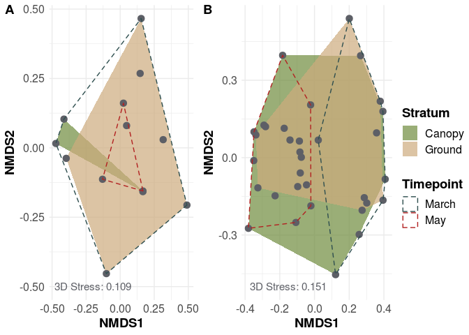

AirSampler\_NMDS
================

## Load Data

``` r
rm(list = ls())

library(vegan)
library(ggplot2)
library(funrar)
library(ggpubr)


OTU_Table = read.csv("../00_Data/Oomycota/05_Oomycota_OTU_Table_new_min-freq-20617_min-feat-5_transposed_withMetadata.tsv", 
                     header=T, stringsAsFactors=TRUE, sep="\t")
species = OTU_Table[,6:ncol(OTU_Table)]
species_mat = as.matrix(species)
species_mat = make_relative(species_mat)
species_mat = log(species_mat +1)
SampleMetadata = as.data.frame(OTU_Table[,1:5])
```

## Preparing the data

``` r
Dist = vegdist(species_mat, 
               diag = T, 
               na.rm = T)

OTU.NMDS.bray = metaMDS(Dist, # The distance matrix
                        distance = "bray", 
                        k=3, # How many dimensions/axes to display 
                        trymax=100, # max number of iterations
                        wascores=TRUE, # Weighted species scores
                        trace=TRUE, 
                        zerodist="add") # What to do with 0's after sqrt transformation

# Get the sample scores and add the metadata
data.scores = as.data.frame(scores(OTU.NMDS.bray))
data.scores$site = rownames(data.scores)
data.scores$Timepoint = SampleMetadata$Timepoint
data.scores$Stratum = SampleMetadata$Stratum
data.scores$TreeSpecies = SampleMetadata$TreeSpecies
data.scores$SampleID = SampleMetadata$X.SampleID

# Group the samples by metadata (in this case, microhabitat and tree species)

Group.Tilia = data.scores[data.scores$TreeSpecies == "Lime",][chull(data.scores[data.scores$TreeSpecies == "Lime", c("NMDS1", "NMDS2")]), ]
Group.Quercus = data.scores[data.scores$TreeSpecies == "Oak",][chull(data.scores[data.scores$TreeSpecies == "Oak", c("NMDS1", "NMDS2")]), ]
Group.Fraxinus = data.scores[data.scores$TreeSpecies == "Ash",][chull(data.scores[data.scores$TreeSpecies == "Ash", c("NMDS1", "NMDS2")]), ]
Group.Crane = data.scores[data.scores$TreeSpecies == "Crane",][chull(data.scores[data.scores$TreeSpecies == "Crane", c("NMDS1", "NMDS2")]), ]

# The hull-data will be needed by ggplot later to draw the polygons
Group.May = data.scores[data.scores$Timepoint == "May",][chull(data.scores[data.scores$Timepoint == "May", c("NMDS1", "NMDS2")]), ]
Group.March = data.scores[data.scores$Timepoint == "March",][chull(data.scores[data.scores$Timepoint == "March", c("NMDS1", "NMDS2")]), ]

Group.Canopy = data.scores[data.scores$Stratum == "Canopy",][chull(data.scores[data.scores$Stratum == "Canopy", c("NMDS1", "NMDS2")]), ]
Group.Ground = data.scores[data.scores$Stratum == "Ground",][chull(data.scores[data.scores$Stratum == "Ground", c("NMDS1", "NMDS2")]), ]

# The hull-data will be needed by ggplot later to draw the polygons

hull.data_TreeSpecies = rbind(Group.Tilia, Group.Quercus, Group.Fraxinus, Group.Crane)

hull.data_Timepoint = rbind(Group.May, Group.March)

hull.data_Stratum = rbind(Group.Canopy, Group.Ground)
```

## Plot NMDS

``` r
g = ggplot() + 
  geom_polygon(data = hull.data_Stratum, 
               aes(x=NMDS1, y=NMDS2, group = Stratum, fill = Stratum), 
               alpha = 0.7, color = NA, linetype = "solid") +
  scale_fill_manual(values = c("darkolivegreen4", "burlywood3")) +
  geom_point(data = data.scores, 
             aes(x = NMDS1, y = NMDS2), 
             size = 3,
             color = "#5d5f66") + 
  geom_polygon(data = hull.data_Timepoint, 
               aes(x=NMDS1, y=NMDS2, group = Timepoint, color = Timepoint), 
               alpha = 0.7, fill = NA, linetype = "dashed") +
  scale_color_manual(values = c("darkslategrey", "firebrick")) +
  geom_text(aes(x = -0.15, y = -0.5, label = as.character(paste0(OTU.NMDS.bray$ndim, "D Stress: ", round(as.numeric(OTU.NMDS.bray$stress), digits = 3)))), parse = F, color = "#5d5f66", size = 4) +
  theme_minimal() +
  theme(axis.text=element_text(size=12), 
        axis.title=element_text(size=14, face = "bold"), 
        legend.text = element_text(size = 12), 
        legend.title = element_text(size = 14, face = "bold"), 
        plot.title = element_text(size = 20, face = "bold", hjust = 0.5))

g
```

<!-- -->

## Load Cerco Data

``` r
OTU_Table_cerco = read.csv("../00_Data/Cercozoa/05_Cercozoa_OTU_Table_min-freq-16922_min-feat-5_transposed_withMetadata.tsv", 
                     header=T, stringsAsFactors=TRUE, sep="\t")
species_cerco = OTU_Table_cerco[,6:ncol(OTU_Table_cerco)]
species_mat_cerco = as.matrix(species_cerco)
species_mat_cerco = make_relative(species_mat_cerco)
species_mat_cerco = log(species_mat_cerco +1)
SampleMetadata_cerco = as.data.frame(OTU_Table_cerco[,1:5])
```

## Prepare Cerco Data

``` r
Dist_cerco = vegdist(species_mat_cerco, 
               diag = T, 
               na.rm = T)

OTU.NMDS.bray_cerco = metaMDS(species_mat_cerco, # The distance matrix
                        distance = "bray", 
                        k=3, # How many dimensions/axes to display 
                        trymax=100, # max number of iterations
                        wascores=TRUE, # Weighted species scores
                        trace=TRUE, 
                        zerodist="add") # What to do with 0's after sqrt transformation
```

    ## Run 0 stress 0.110583 
    ## Run 1 stress 0.1140196 
    ## Run 2 stress 0.1127891 
    ## Run 3 stress 0.1127883 
    ## Run 4 stress 0.112803 
    ## Run 5 stress 0.1243556 
    ## Run 6 stress 0.1261342 
    ## Run 7 stress 0.1139667 
    ## Run 8 stress 0.1269665 
    ## Run 9 stress 0.1094909 
    ## ... New best solution
    ## ... Procrustes: rmse 0.08895774  max resid 0.1926075 
    ## Run 10 stress 0.1139669 
    ## Run 11 stress 0.1315318 
    ## Run 12 stress 0.1140006 
    ## Run 13 stress 0.113029 
    ## Run 14 stress 0.1382523 
    ## Run 15 stress 0.1095042 
    ## ... Procrustes: rmse 0.006233816  max resid 0.01465864 
    ## Run 16 stress 0.1139455 
    ## Run 17 stress 0.1243526 
    ## Run 18 stress 0.1105884 
    ## Run 19 stress 0.1139479 
    ## Run 20 stress 0.1128 
    ## Run 21 stress 0.1293889 
    ## Run 22 stress 0.1284844 
    ## Run 23 stress 0.1140081 
    ## Run 24 stress 0.1139991 
    ## Run 25 stress 0.1294988 
    ## Run 26 stress 0.1157436 
    ## Run 27 stress 0.1105788 
    ## Run 28 stress 0.1243526 
    ## Run 29 stress 0.1105821 
    ## Run 30 stress 0.1139978 
    ## Run 31 stress 0.1311248 
    ## Run 32 stress 0.112794 
    ## Run 33 stress 0.1128037 
    ## Run 34 stress 0.1105751 
    ## Run 35 stress 0.1128006 
    ## Run 36 stress 0.1315348 
    ## Run 37 stress 0.1139613 
    ## Run 38 stress 0.1139695 
    ## Run 39 stress 0.1095168 
    ## ... Procrustes: rmse 0.008963409  max resid 0.02081374 
    ## Run 40 stress 0.1127903 
    ## Run 41 stress 0.121367 
    ## Run 42 stress 0.1128064 
    ## Run 43 stress 0.1315318 
    ## Run 44 stress 0.1095003 
    ## ... Procrustes: rmse 0.005049222  max resid 0.01224291 
    ## Run 45 stress 0.1127928 
    ## Run 46 stress 0.1127916 
    ## Run 47 stress 0.1139493 
    ## Run 48 stress 0.1183346 
    ## Run 49 stress 0.1247599 
    ## Run 50 stress 0.1095182 
    ## ... Procrustes: rmse 0.009246216  max resid 0.02143507 
    ## Run 51 stress 0.1095108 
    ## ... Procrustes: rmse 0.007695069  max resid 0.01814233 
    ## Run 52 stress 0.1105808 
    ## Run 53 stress 0.1139473 
    ## Run 54 stress 0.1095014 
    ## ... Procrustes: rmse 0.005570667  max resid 0.01291887 
    ## Run 55 stress 0.109493 
    ## ... Procrustes: rmse 0.003124354  max resid 0.006966107 
    ## ... Similar to previous best
    ## *** Solution reached

    ## Warning in postMDS(out$points, dis, plot = max(0, plot - 1), ...): skipping
    ## half-change scaling: too few points below threshold

``` r
# Get the sample scores and add the metadata
data.scores_cerco = as.data.frame(scores(OTU.NMDS.bray_cerco))
data.scores_cerco$site = rownames(data.scores_cerco)
data.scores_cerco$Timepoint = SampleMetadata_cerco$Timepoint
data.scores_cerco$Stratum = SampleMetadata_cerco$Stratum
data.scores_cerco$TreeSpecies = SampleMetadata_cerco$TreeSpecies
data.scores_cerco$SampleID = SampleMetadata_cerco$X.SampleID

# Group_cerco the samples by metadata (in this case, microhabitat and tree species)

Group_cerco.Tilia = data.scores_cerco[data.scores_cerco$TreeSpecies == "Lime",][chull(data.scores_cerco[data.scores_cerco$TreeSpecies == "Lime", c("NMDS1", "NMDS2")]), ]
Group_cerco.Quercus = data.scores_cerco[data.scores_cerco$TreeSpecies == "Oak",][chull(data.scores_cerco[data.scores_cerco$TreeSpecies == "Oak", c("NMDS1", "NMDS2")]), ]
Group_cerco.Fraxinus = data.scores_cerco[data.scores_cerco$TreeSpecies == "Ash",][chull(data.scores_cerco[data.scores_cerco$TreeSpecies == "Ash", c("NMDS1", "NMDS2")]), ]
Group_cerco.Crane = data.scores_cerco[data.scores_cerco$TreeSpecies == "Crane",][chull(data.scores_cerco[data.scores_cerco$TreeSpecies == "Crane", c("NMDS1", "NMDS2")]), ]

# The hull-data will be needed by ggplot later to draw the polygons
Group_cerco.May = data.scores_cerco[data.scores_cerco$Timepoint == "May",][chull(data.scores_cerco[data.scores_cerco$Timepoint == "May", c("NMDS1", "NMDS2")]), ]
Group_cerco.March = data.scores_cerco[data.scores_cerco$Timepoint == "March",][chull(data.scores_cerco[data.scores_cerco$Timepoint == "March", c("NMDS1", "NMDS2")]), ]

Group_cerco.Canopy = data.scores_cerco[data.scores_cerco$Stratum == "Canopy",][chull(data.scores_cerco[data.scores_cerco$Stratum == "Canopy", c("NMDS1", "NMDS2")]), ]
Group_cerco.Ground = data.scores_cerco[data.scores_cerco$Stratum == "Ground",][chull(data.scores_cerco[data.scores_cerco$Stratum == "Ground", c("NMDS1", "NMDS2")]), ]

# The hull-data will be needed by ggplot later to draw the polygons

hull.data_cerco_TreeSpecies = rbind(Group_cerco.Tilia, Group_cerco.Quercus, Group_cerco.Fraxinus, Group_cerco.Crane)

hull.data_cerco_Timepoint = rbind(Group_cerco.May, Group_cerco.March)

hull.data_cerco_Stratum = rbind(Group_cerco.Canopy, Group_cerco.Ground)
```

## Plot Cerco Data

``` r
g_cerco = ggplot() + 
  geom_polygon(data = hull.data_cerco_Stratum, 
               aes(x=NMDS1, y=NMDS2, group = Stratum, fill = Stratum), 
               alpha = 0.7, color = NA, linetype = "solid") +
  scale_fill_manual(values = c("darkolivegreen4", "burlywood3")) +
  geom_point(data = data.scores_cerco, 
             aes(x = NMDS1, y = NMDS2), 
             size = 3,
             color = "#5d5f66") + 
  geom_polygon(data = hull.data_cerco_Timepoint, 
               aes(x=NMDS1, y=NMDS2, group = Timepoint, color = Timepoint), 
               alpha = 0.7, fill = NA, linetype = "dashed") +
  scale_color_manual(values = c("darkslategrey", "firebrick")) +
  geom_text(aes(x = -0.2, y = -0.5, 
                label = as.character(paste0(OTU.NMDS.bray_cerco$ndim, "D Stress: ", round(as.numeric(OTU.NMDS.bray_cerco$stress), digits = 3)))), parse = F, color = "#5d5f66", size = 4) +
  theme_minimal() + 
  theme(axis.text=element_text(size=12), 
        axis.title=element_text(size=14, face = "bold"), 
        legend.text = element_text(size = 12), 
        legend.title = element_text(size = 14, face = "bold"), 
        plot.title = element_text(size = 20, face = "bold", hjust = 0.5))

g_cerco
```

<!-- -->

## Combine Plots

``` r
g$labels$title = NULL
g_cerco$labels$title = NULL
combi = ggarrange(g_cerco, g, 
                  labels = c("A", "B"), 
                  ncol = 2, nrow = 1, 
                  common.legend = T, legend = "right", 
                  align = "h", vjust = 1.5) #%>%
  #annotate_figure(fig.lab = "Figure X", fig.lab.face = "bold", 
  #                fig.lab.size = 18, 
  #                top = text_grob("Non-metric multidimensional scaling", 
  #                                face = "bold", size = 20))
#ggsave("NMDSCombined.tif", plot = combi, 
#       device = "tiff", dpi = 600, width = 28, height = 11, 
#       units = "cm")
ggsave("AirSampler_NMDSCombined.png", plot = combi, 
       device = "png", dpi = 300, width = 17.7, height = 8, 
       units = "cm")
ggsave("AirSampler_NMDSCombined.jpeg", plot = combi, 
       device = "jpeg", dpi = 300, width = 17.7, height = 8, 
       units = "cm")
ggsave("AirSampler_NMDSCombined.pdf", plot = combi, 
       device = "pdf", dpi = 300, width = 17.7, height = 8, 
       units = "cm")
ggsave("AirSampler_NMDSCombined.tiff", plot = combi, 
       device = "tiff", dpi = 300, width = 17.7, height = 8, 
       units = "cm", compression = "lzw")

combi
```

<!-- -->
